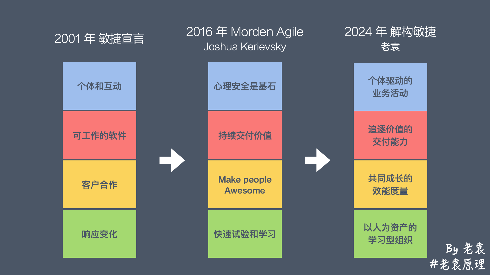

以上这四个方向，对于处在不同位置的角色（团队级、跨团队、Agile Coach、企业级、个人目标），都有一系列对应的知识体系。

当我们遇到具体问题的时候，例如：

怎样拆解需求？需求归口太多，怎么管？优先级乱来，怎么管？

如何向领导汇报？或是争取资源？如何给项目争取更多的时间？

如何识别团队的“恐惧”？面对“有毒”的组员，如何发起一次正式严肃的谈话？

如何建立质量体系？如何推进一项组织变革？如何搭建 DevOps 团队？如何管理团队知识库？

在没有实权的情况下，如何建立影响力？

新人得怎么带？公司的新手村该怎么组织？

并不是一两句“聪明话”，就解决问题的，而是背后的知识体系支撑。



